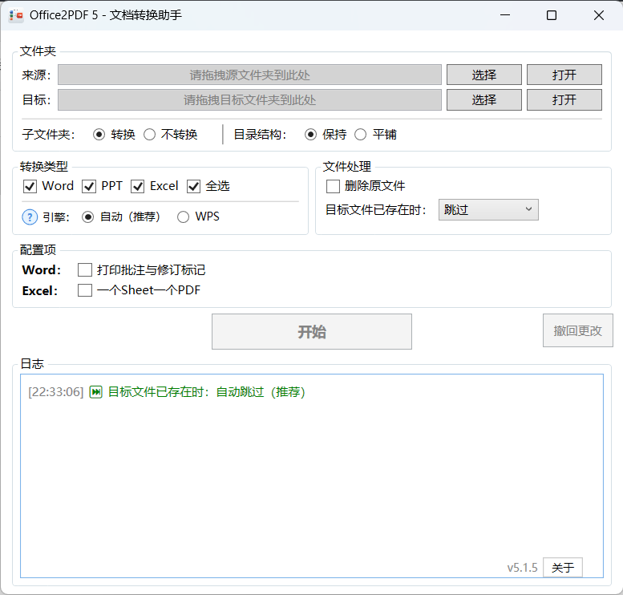

# Office2PDF-dotnet

一个基于 .NET 开发的 Office 文档批量转 PDF 工具，支持 Word、Excel、PPT 格式转换，兼容 MS Office 和 WPS Office 双引擎。

> 本项目基于 [evgo2017/Office2PDF-dotnet](https://github.com/evgo2017/Office2PDF-dotnet) 进行改进和优化开发。

## 📥 下载使用

下载地址：[Github Release](https://github.com/a90091343/Office2PDF-dotnet/releases)

## 一、功能特性

### 🚀 核心功能

- **批量转换**：支持 Word (.doc/.docx)、Excel (.xls/.xlsx)、PowerPoint (.ppt/.pptx) 批量转换为 PDF
- **双引擎支持**：兼容 Microsoft Office 和 WPS Office，可自由切换
- **目录结构保持**：支持保持原文件夹结构或平铺到目标文件夹
- **子文件夹处理**：可选择是否递归处理子文件夹中的文件

### ⚙️ 高级选项

- **Word 选项**：可选择是否在 PDF 中包含批注和修订内容
- **Excel 选项**：支持将每个 Sheet 导出为单独的 PDF 文件
- **文件管理**：转换成功后可选择自动删除原文件
- **撤回功能**：支持一键撤回所有更改，恢复原始状态
- **实时监控**：提供详细的转换日志和进度反馈
- **转换统计**：显示总文件数、成功数、失败数的详细统计

### 🔧 系统要求

#### 运行环境

- **操作系统**：Windows 7 及以上版本
- **运行时**：.NET Framework 4.8

#### Office 软件要求

选择以下任一 Office 套件：

##### Microsoft Office

- Office 2007 及以后版本（推荐 Office 2016 及以上）
- Office 2007 以前版本需安装 [Microsoft Save as PDF 加载项](https://www.microsoft.com/zh-cn/download/details.aspx?id=7)

##### WPS Office

- WPS Office 2019 及以上版本
- 支持 WPS 文字、WPS 表格、WPS 演示

### 📋 转换细节

|            | Word | Excel                                | PowerPoint        |
| ---------- | ---- | ------------------------------------ | ----------------- |
| 文档有内容 | ✅    | ✅（可选择每个Sheet生成独立PDF）     | ✅（支持多页面）   |
| 文档无内容 | ✅    | ❌（跳过空文档）                     | ❌（跳过空演示文稿） |
| 批注支持   | ✅    | -                                    | -                 |
| 多Sheet   | -    | ✅（可选择合并或分离）                | -                 |

### 🎯 使用方法

1. **下载安装**
   - 下载并解压程序包
   - 确保已安装 .NET Framework 4.8 运行时

2. **选择来源**
   - 拖拽文件夹到程序界面，或点击"浏览"按钮选择
   - 目标文件夹会自动生成（也可手动设置）

3. **配置选项**
   - 选择要转换的文件类型（Word/Excel/PPT）
   - 选择 Office 引擎（MS Office 或 WPS Office）
   - 配置高级选项（批注、Sheet 分离等）

4. **开始转换**
   - 点击"开始"按钮启动转换
   - 实时查看转换进度和日志
   - 转换完成后查看统计结果

## 二、版本历史

| 时间       | 版本 | 内容                                                         | 贡献者 |
| ---------- | ---- | ------------------------------------------------------------ | ------ |
| 2025.08.24起 | v5.x | 新增WPS引擎支持（感谢 iOS-执着）、转换结果汇总、撤回功能、路径处理优化、用户体验全面提升 | azhan |
| 2025.05.29 | v3.0 | 基于 .NET 重构并开源                                         | evgo2017 |
| 2020.08.26 | v2.0 | 加入 GUI，支持选择类型、子文件夹等功能                       | evgo2017 |
| 2018.11.02 | v1.0 | 功能基本实现                                                 | evgo2017 |

> 详细的版本更新记录请查看 [CHANGELOG.md](./CHANGELOG.md)

## 三、主要特性介绍

### v5.x 主要改进

- **🔄 双引擎支持**：完整支持 Microsoft Office 和 WPS Office 两套引擎
- **📊 智能统计**：提供详细的转换结果统计和失败文件列表
- **🎛️ 高级选项**：Word 批注控制、Excel Sheet 分离、原文件管理等
- **💼 企业级稳定性**：完善的 COM 对象生命周期管理，避免进程残留
- **🎨 用户体验**：自动路径生成、拖拽支持、实时进度反馈

### 核心优势

1. **兼容性强**：支持新旧版本的 Office 文档格式
2. **稳定可靠**：经过大量测试，处理各种异常情况
3. **操作简便**：图形界面直观，支持批量处理
4. **功能丰富**：提供多种转换选项和文件管理功能
5. **支持 Windows 7**：兼容 Windows 7 及以上版本

---

## 💝 贡献与支持

感谢所有为本项目做出贡献的开发者：

- **evgo2017** - 原始项目创建者和 v1-v3 开发
- **azhan** - v5.x 版本重大改进和优化（感谢 GitHub Copilot 协助）
- **iOS-执著** - 提供了 WPS Excel/PPT 转换的关键思路 ([WPSToPDF](https://gitee.com/BudStudio/WPSToPDF))

如果您在使用过程中遇到问题或有改进建议，欢迎：

- 提交 [Issue](https://github.com/a90091343/Office2PDF-dotnet/issues)
- 发起 [Pull Request](https://github.com/a90091343/Office2PDF-dotnet/pulls)
- 查看详细更新日志：[CHANGELOG.md](./CHANGELOG.md)

## 📄 许可证

本项目采用 [MIT 许可证](./LICENSE)，详情请查看 [盈利禁令.md](./盈利禁令.md) 和 [NO_PROFIT.md](./NO_PROFIT.md)。
